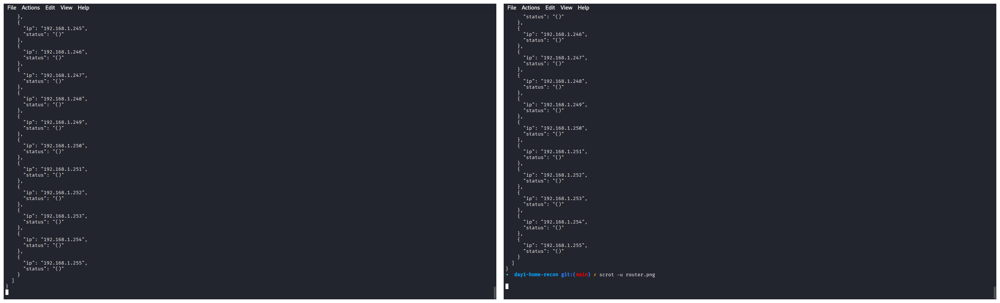

# Day 1: Home Network Recon

### 🎯 Objective
Map live hosts on my own private network (192.168.1.0/24) and output JSON.

### 🛠️ Usage
\`\`\`bash
./netmap.py 192.168.1.0/24
\`\`\`

### 📸 Proof

Contents of \`map.json\`:
\`\`\`json
{
  "devices": [
    {"ip": "192.168.1.1", "status": "Up"},
    {"ip": "192.168.1.22", "status": "Up"}
  ]
}
\`\`\`

### 🚀 Next Steps
- Extend to service/version detection (\`nmap -sV\`)  
- Visualize results as a node graph with Graphviz  
- Automate daily scans via cron and commit changes
